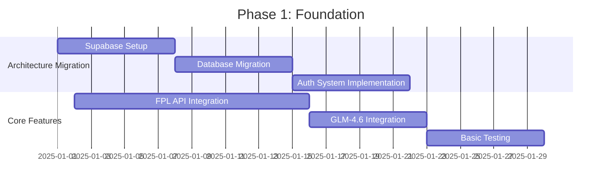
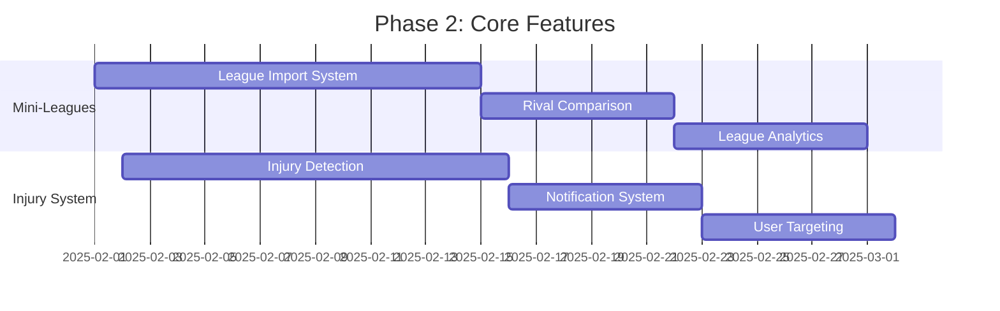
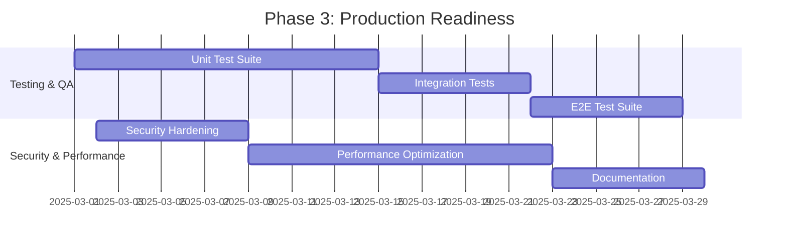

# FPL AI Advisor Application: Comprehensive Synthesis & Prioritized Recommendations

## Executive Summary

**Project Status:** 40% Complete - Major Architectural and Feature Gaps Identified  
**Overall Assessment:** The application has a solid UI foundation but requires significant backend rework and feature implementation to meet production requirements.  
**Estimated Time to Production:** 330-440 hours (4-6 months with dedicated resources)  
**Critical Blockers:** 5 major issues preventing MVP functionality  

---

## Current State Assessment

### What Works Well ✅
1. **UI/UX Foundation** - Professional landing page, responsive design with Tailwind CSS
2. **Component Library** - Complete shadcn/ui integration with consistent design system
3. **Basic Structure** - Login/signup flow, dashboard, advisor chat interface
4. **Database Schema** - Well-designed Prisma models covering most requirements
5. **Guest Mode** - Smart addition for user acquisition
6. **TypeScript Implementation** - Good type safety throughout codebase

### Critical Missing Features ❌
1. **No FPL API Integration** - Core functionality completely absent
2. **Wrong Backend Architecture** - SQLite instead of Supabase PostgreSQL
3. **Incorrect AI Implementation** - Using z-ai-web-dev-sdk instead of GLM-4.6 API
4. **Missing Mini-League Features** - Core differentiator not implemented
5. **No Injury Alert System** - Key competitive feature absent
6. **Insecure Authentication** - localStorage instead of proper auth system

---

## Synthesized Findings by Category

### 1. Architecture Analysis
**Current State:** Modern tech stack with fundamental architectural flaws
- **Frontend:** Next.js 15, React 19, TypeScript ✅
- **Database:** Prisma + SQLite (should be Supabase PostgreSQL) ❌
- **Authentication:** Custom localStorage (should be Supabase Auth) ❌
- **AI Integration:** z-ai-web-dev-sdk (should be GLM-4.6 API) ❌

**Impact:** 🔴 **BLOCKER** - Architecture changes affect entire codebase

### 2. Code Quality Review
**Current State:** Generally good code organization with specific issues
- **Strengths:** TypeScript throughout, Zod validation, clean component structure
- **Weaknesses:** Large components, inconsistent patterns, missing error boundaries
- **Technical Debt:** Medium - Requires refactoring but not blocking

**Impact:** 🟡 **MEDIUM** - Affects maintainability but not functionality

### 3. Security Assessment
**Current State:** Critical vulnerabilities in authentication and data protection
- **Authentication Issues:** Client-side only, easily bypassable
- **Data Protection:** No encryption, insecure session management
- **API Security:** Missing rate limiting, input validation gaps

**Impact:** 🔴 **BLOCKER** - Cannot deploy with current security model

### 4. Test Coverage Analysis
**Current State:** Complete absence of testing infrastructure
- **Unit Tests:** 0% coverage
- **Integration Tests:** None implemented
- **E2E Tests:** No automated testing

**Impact:** 🟠 **HIGH** - High risk of regressions, deployment issues

### 5. Performance Assessment
**Current State:** Significant optimization opportunities
- **Database:** No indexing, inefficient queries
- **Frontend:** No caching, missing optimization
- **API:** No rate limiting, potential bottlenecks

**Impact:** 🟡 **MEDIUM** - Will affect user experience at scale

### 6. Functionality Evaluation
**Current State:** Basic implementation missing core FPL features
- **Core Features:** Team import (partial), AI chat (basic)
- **Missing Features:** FPL API integration, mini-leagues, injury alerts
- **User Experience:** Limited functionality without real data

**Impact:** 🔴 **BLOCKER** - App is non-functional without FPL data

### 7. Documentation Review
**Current State:** Severely lacking documentation across all categories
- **API Documentation:** Missing
- **Setup Instructions:** Incomplete
- **Code Comments:** Sparse
- **User Documentation:** Absent

**Impact:** 🟠 **HIGH** - Hinders development and onboarding

### 8. Timeline & Resource Evaluation
**Current State:** Significant effort required for production readiness
- **Backend Migration:** 80-120 hours
- **Feature Implementation:** 150-200 hours
- **Testing & QA:** 60-80 hours
- **Documentation:** 40-60 hours

**Total Estimated:** 330-440 hours

### 9. Risk Identification
**Critical Risks:**
- Architecture incompatibility with requirements
- Security vulnerabilities preventing deployment
- Missing core functionality making app unusable

**High Risks:**
- Performance issues at scale
- Poor user experience without features
- Technical debt accumulation

---

## Common Themes & Interconnected Issues

### Theme 1: Architecture-Feature Dependency Chain
```
Wrong Database (SQLite) → No Real-time Updates → No Injury Alerts
Wrong Auth (localStorage) → No Secure Sessions → No User Trust
Wrong AI (z-ai-sdk) → No GLM-4.6 Features → Poor Recommendations
No FPL API → No Real Data → No Core Functionality
```

### Theme 2: Security-Production Readiness Connection
- Current authentication model prevents any production deployment
- Data protection issues create compliance risks
- API security gaps expose application to attacks

### Theme 3: Feature Completeness Impact
- Missing FPL API integration makes the app non-functional
- Absence of mini-league features removes key differentiator
- No injury alerts eliminate competitive advantage

---

## Prioritized Recommendations

### Priority 1: CRITICAL BLOCKERS (Must Fix First)
1. **Migrate to Supabase Architecture**
   - Replace Prisma/SQLite with Supabase PostgreSQL
   - Implement proper authentication system
   - Add Row-Level Security policies
   - **Timeline:** 2-3 weeks
   - **Impact:** Enables all other features

2. **Implement FPL API Integration**
   - Create comprehensive FPL API client
   - Add team import functionality
   - Implement data transformation
   - **Timeline:** 2-3 weeks
   - **Impact:** Makes app functional

3. **Switch to GLM-4.6 API**
   - Replace z-ai-web-dev-sdk
   - Implement proper AI integration
   - Add thinking mode and context features
   - **Timeline:** 1-2 weeks
   - **Impact:** Improves recommendation quality

### Priority 2: CORE DIFFERENTIATORS (Key Value Proposition)
4. **Add Mini-League Features**
   - Implement league import and analysis
   - Create rival comparison tools
   - Add differential recommendations
   - **Timeline:** 3-4 weeks
   - **Impact:** Main competitive advantage

5. **Implement Injury Alert System**
   - Create scraping/detection system
   - Add notification infrastructure
   - Implement user targeting
   - **Timeline:** 2-3 weeks
   - **Impact:** Key user retention feature

### Priority 3: PRODUCTION READINESS (Deployment Requirements)
6. **Add Comprehensive Testing**
   - Unit tests for critical functions
   - Integration tests for API routes
   - E2E tests for user flows
   - **Timeline:** 3-4 weeks
   - **Impact:** Deployment safety

7. **Implement Security Hardening**
   - Add rate limiting
   - Implement input validation
   - Add security headers
   - **Timeline:** 1-2 weeks
   - **Impact:** Production compliance

### Priority 4: ENHANCEMENTS (User Experience)
8. **Performance Optimization**
   - Add caching layers
   - Implement database indexing
   - Optimize bundle size
   - **Timeline:** 2-3 weeks
   - **Impact:** User experience

9. **Documentation Creation**
   - API documentation
   - Setup guides
   - User manuals
   - **Timeline:** 2-3 weeks
   - **Impact:** Development efficiency

---

## Implementation Roadmap

### Phase 1: Foundation (Weeks 1-6)
**Goal:** Establish production-ready architecture



**Deliverables:**
- Working Supabase backend
- Functional FPL API integration
- Proper GLM-4.6 AI integration
- Basic authentication system

### Phase 2: Core Features (Weeks 7-12)
**Goal:** Implement key differentiators



**Deliverables:**
- Complete mini-league functionality
- Injury alert system
- Enhanced AI recommendations

### Phase 3: Production Readiness (Weeks 13-18)
**Goal:** Prepare for deployment



**Deliverables:**
- Comprehensive test coverage
- Security compliance
- Performance optimization
- Complete documentation

---

## Resource Allocation Recommendations

### Team Structure
- **Backend Developer (1):** Focus on architecture migration and API development
- **Frontend Developer (1):** Implement UI features and user experience
- **QA Engineer (0.5):** Test implementation and quality assurance
- **DevOps Engineer (0.5):** Deployment and infrastructure setup

### Budget Allocation
- **Development:** 70% (Backend migration, feature implementation)
- **Testing:** 15% (QA, test automation)
- **Infrastructure:** 10% (Supabase setup, deployment)
- **Documentation:** 5% (API docs, user guides)

---

## Success Metrics & KPIs

### Technical Metrics
- **Code Coverage:** Target 80%+ test coverage
- **API Response Time:** <200ms for 95% of requests
- **Database Query Time:** <100ms average
- **Security Score:** Zero critical vulnerabilities

### Business Metrics
- **User Engagement:** 3+ sessions per user per week
- **Feature Adoption:** 70%+ users import teams
- **AI Satisfaction:** 4.0+ average rating
- **Retention Rate:** 60%+ monthly active users

### Development Metrics
- **Velocity:** 40-50 story points per sprint
- **Bug Rate:** <5 bugs per sprint
- **Technical Debt:** <2 days per sprint
- **Documentation:** 100% API coverage

---

## Risk Mitigation Strategies

### Technical Risks
1. **Migration Complexity**
   - Strategy: Incremental migration with rollback plan
   - Contingency: Parallel development environment

2. **API Rate Limits**
   - Strategy: Implement caching and request queuing
   - Contingency: Multiple API providers

3. **Performance Bottlenecks**
   - Strategy: Early performance testing
   - Contingency: Scalable architecture design

### Business Risks
1. **Timeline Delays**
   - Strategy: Agile development with MVP focus
   - Contingency: Feature prioritization

2. **Resource Constraints**
   - Strategy: Cross-training team members
   - Contingency: External contractor support

---

## Decision Points & Recommendations

### Immediate Decisions Required
1. **Architecture Commitment:** Confirm Supabase migration approach
2. **Resource Allocation:** Approve team structure and budget
3. **Timeline Validation:** Adjust based on available resources
4. **Feature Scope:** Confirm MVP feature set

### Strategic Recommendations
1. **Phase 1 Focus:** Prioritize architecture over features
2. **User Feedback:** Implement early user testing program
3. **Technical Debt:** Address during initial development
4. **Scalability:** Design for growth from day one

---

## Expected Outcomes

### With Proper Implementation
- **Production-Ready Application:** Secure, scalable, and feature-complete
- **Competitive Advantage:** Unique mini-league and injury features
- **User Satisfaction:** High-quality AI recommendations
- **Technical Excellence:** Modern architecture with best practices

### Without Proper Implementation
- **Non-Functional Application:** Missing core features
- **Security Risks:** Vulnerable to attacks
- **Poor User Experience:** Slow, unreliable, limited features
- **Technical Debt:** Increasing maintenance costs

---

## Conclusion

The FPL AI Advisor application has a solid foundation but requires significant work to meet production requirements. The primary focus should be on:

1. **Architecture Migration:** Switch to Supabase for scalability and features
2. **Core Feature Implementation:** Add FPL API integration and mini-leagues
3. **Security & Testing:** Ensure production readiness

With proper execution of the recommended roadmap, the application can achieve production readiness within 4-6 months and provide a competitive FPL advisory service with unique differentiators in the market.

The key to success is prioritizing the critical blockers first while maintaining a clear focus on the core value proposition: helping users beat their friends in mini-leagues through data-driven recommendations.