# FPL AI Advisor: Visualizations & Diagrams

## Current State Assessment

### Project Completion Overview

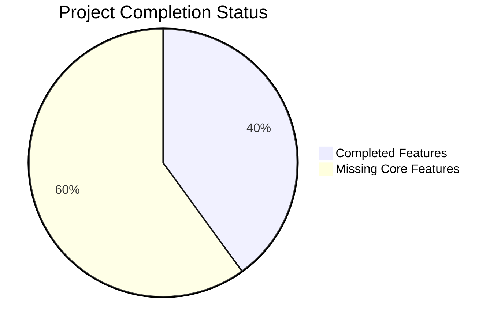

### Feature Implementation Status

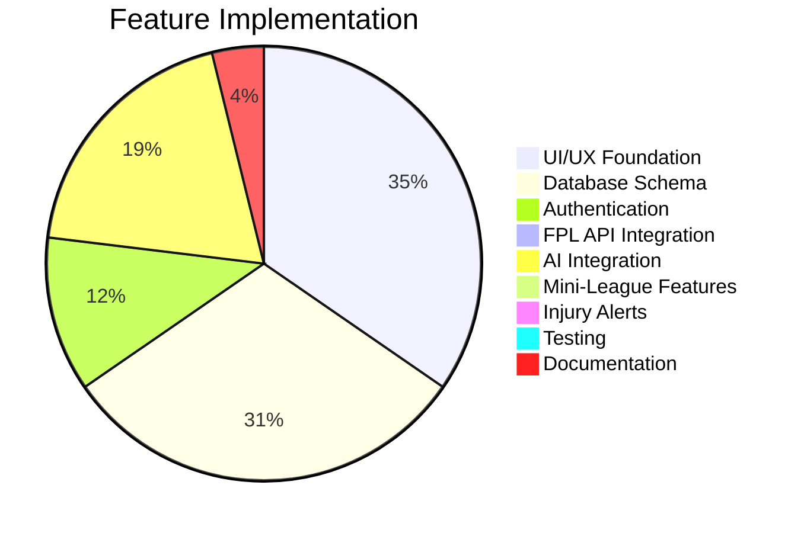

### Risk Impact Matrix

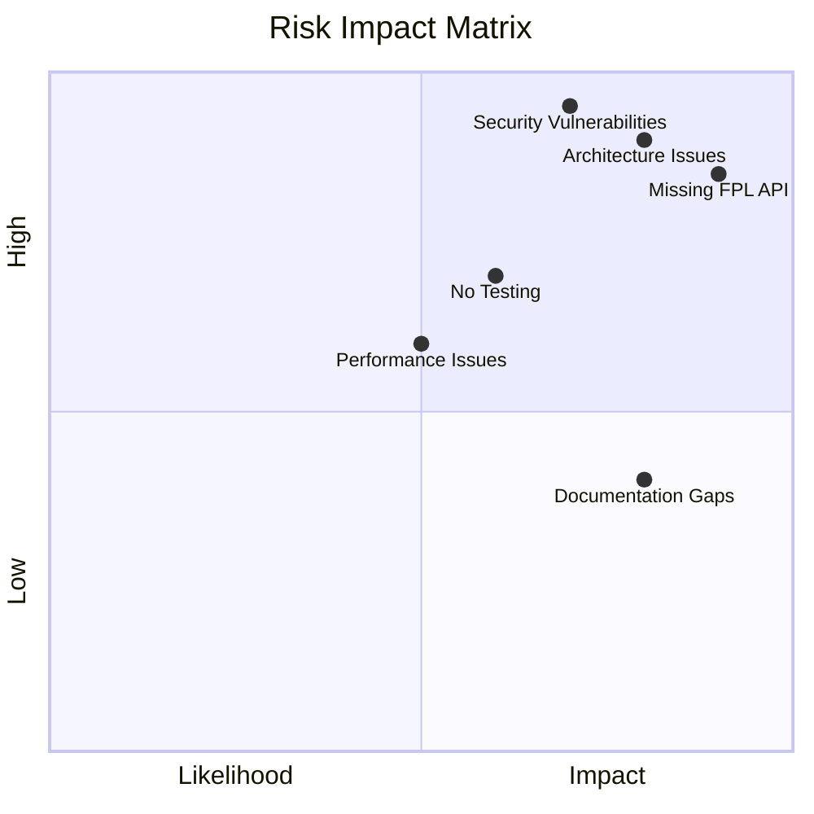

## Architecture Comparison

### Current vs. Target Architecture

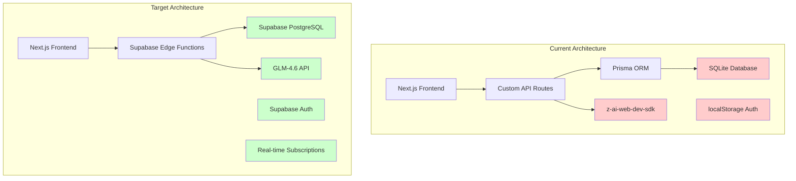

### Data Flow Architecture

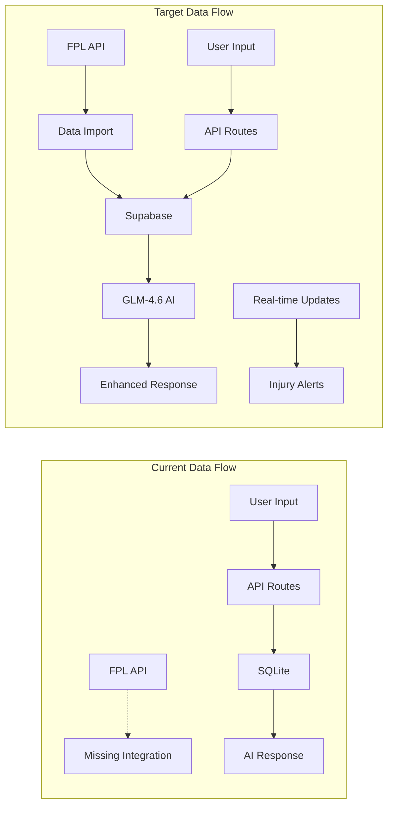

## Implementation Roadmap

### Phase 1: Foundation (Weeks 1-6)

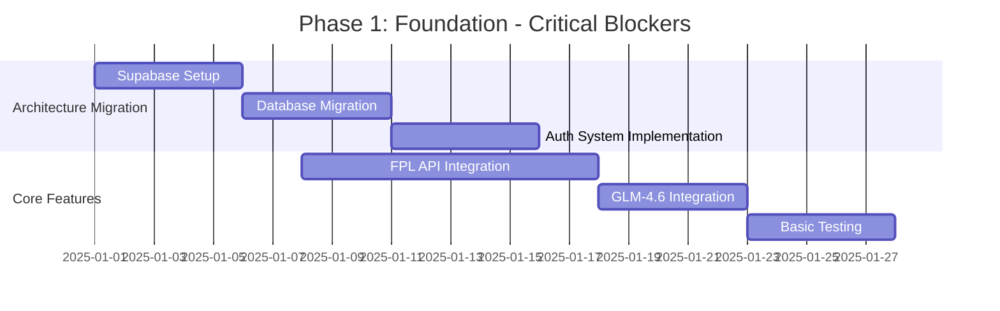

### Phase 2: Core Features (Weeks 7-12)

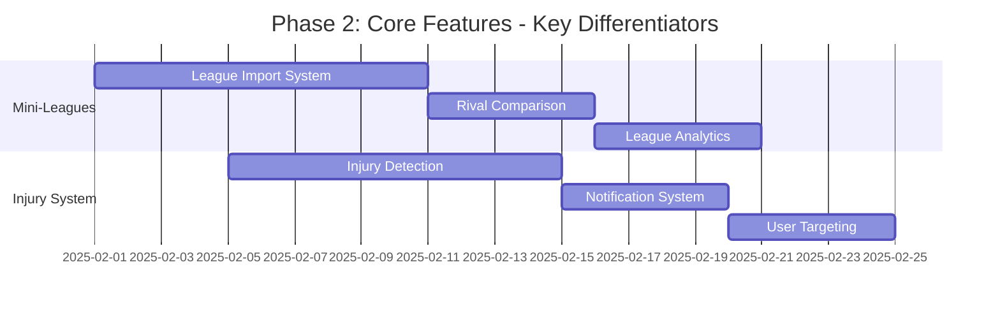

### Phase 3: Production Readiness (Weeks 13-18)

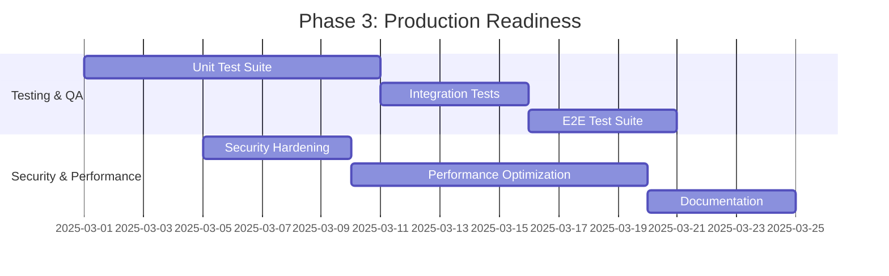

## Priority Matrix

### Feature Priority vs. Effort

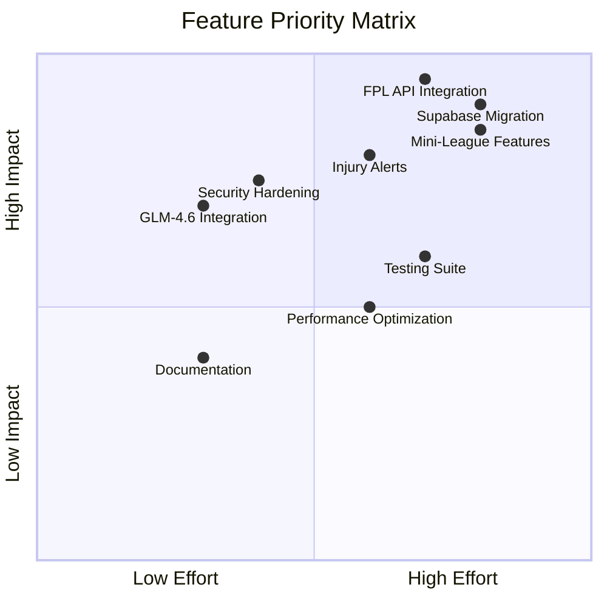

## Resource Allocation

### Team Structure & Budget

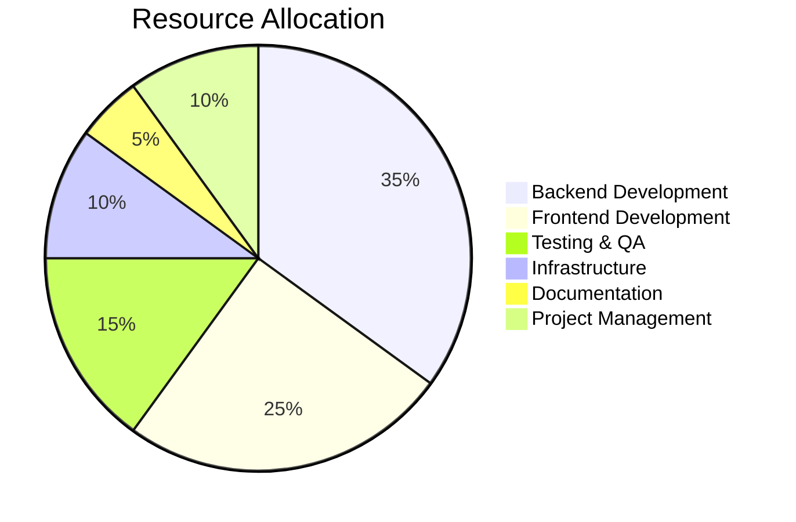

### Skill Requirements

```mermaid
radarChart
    title Skill Requirements
    axis "Backend", "Frontend", "Database", "AI/ML", "DevOps", "Testing"
    "Current Team" : [7, 8, 6, 4, 5, 3]
    "Required Skills" : [9, 8, 9, 7, 7, 8]
```

## Success Metrics

### Technical KPIs

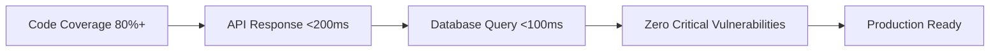

### Business KPIs

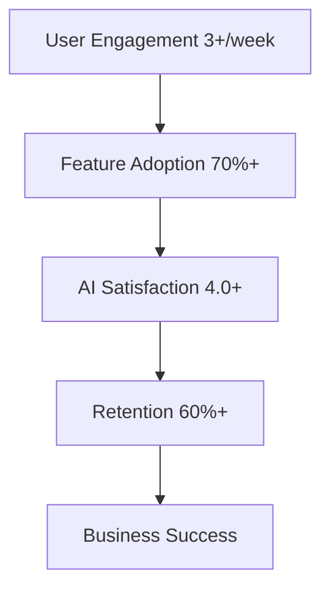

## Risk Mitigation

### Risk Response Strategies

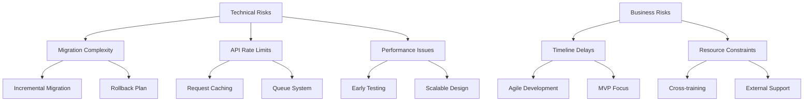

## Decision Tree

### Go/No-Go Decision Points

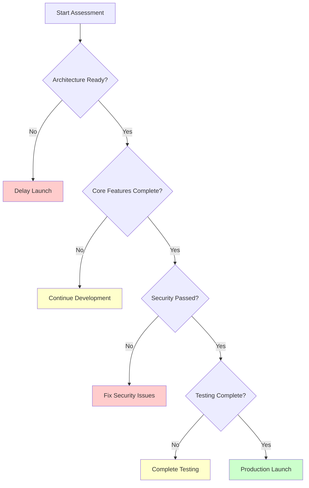

## Implementation Dependencies

### Feature Dependency Map

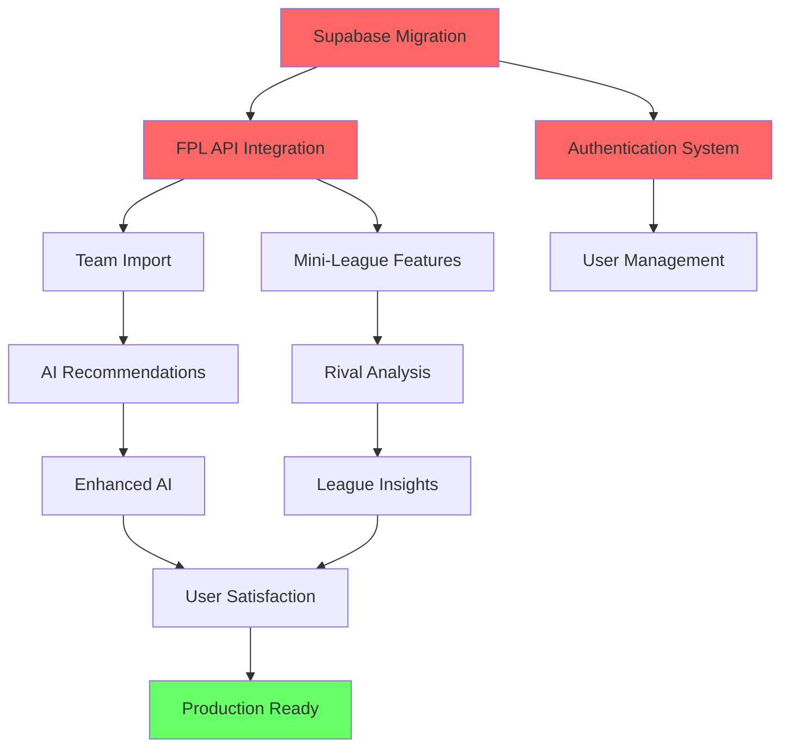

## Timeline Comparison

### Current vs. Optimized Timeline

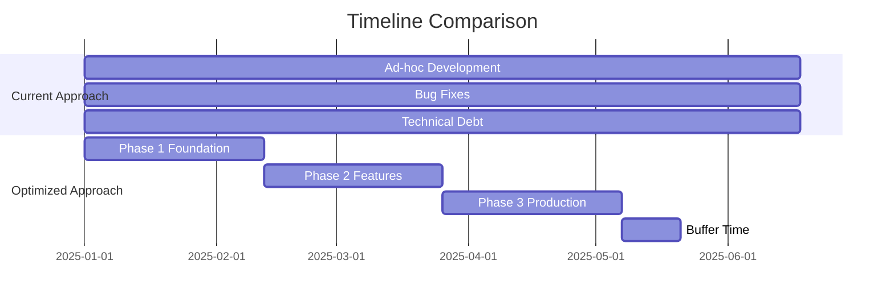

## Cost-Benefit Analysis

### Investment vs. Return

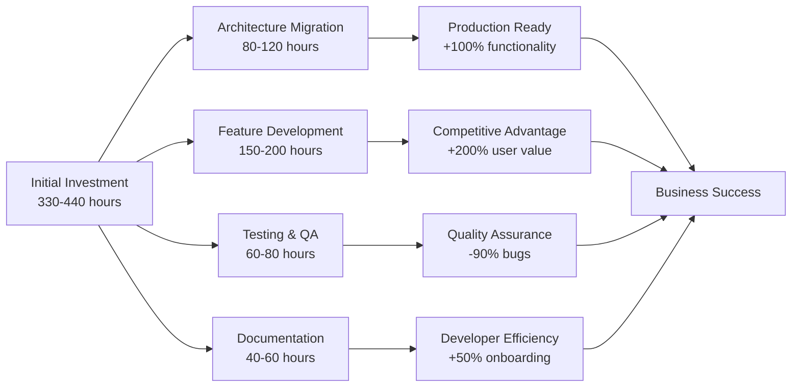

---

## Summary

These visualizations provide a comprehensive view of:

1. **Current State:** Project completion, feature gaps, and risk assessment
2. **Architecture:** Current vs. target system design
3. **Roadmap:** Detailed implementation timeline across three phases
4. **Priorities:** Feature prioritization based on impact and effort
5. **Resources:** Team structure and skill requirements
6. **Metrics:** Success indicators for technical and business goals
7. **Risks:** Mitigation strategies for identified challenges
8. **Decisions:** Key decision points and dependencies

The visualizations complement the detailed synthesis report and provide clear guidance for project advancement.